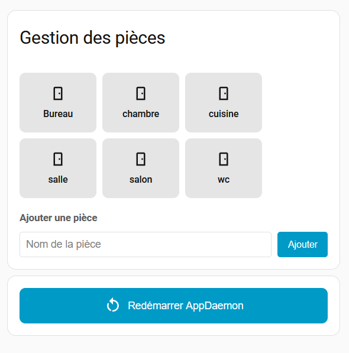
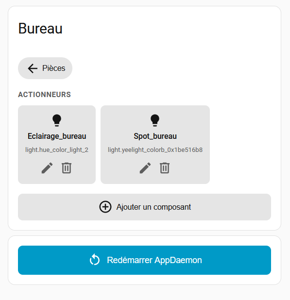

# 🏠 Home Assistant Index Manager Card

[](https://github.com/Shark-44/Index_Manager_Card/releases)
[](LICENSE)
[](https://community.home-assistant.io)




A system to organize Home Assistant entities by rooms and components, with an AppDaemon backend and a custom Lovelace card.

---

## ✨ Features

- Create and manage rooms
- Display actuators and sensors per room
- Custom Lovelace card (LitElement)
- AppDaemon REST API
- Demo automation included
- 🌍 Multilingual support (French, English — more welcome via PR)
- 🔁 Replace a device without breaking automations (via component abstraction)

---

## 🧠 Core Idea

Instead of using raw entities directly in your automations:

```
light.salon_lamp
```

You use logical components:

```
Salon → Lampe
```

Mapping handled by AppDaemon:

```
lampe_salon → light.salon_lamp
```

If you replace the device:

```
lampe_salon → light.new_lamp
```

✅ No automation needs to change

---

## 📋 Prerequisites

- Home Assistant
- AppDaemon addon
- HACS (optional)

---

## 📁 Installation Structure

### AppDaemon (apps)

```
config/appdaemon/apps/
├── api_index.py
├── demo_bureau.py
└── apps.yaml
```

### AppDaemon config

If you use the AppDaemon addon:

```
/addon_configs/a0d7b954_appdaemon/appdaemon.yaml
```

### Frontend (custom card)

```
config/www/index-manager/
├── index-manager-card.js    ← entry point
├── api.js
├── entities.js
├── styles.js
└── i18n/
    └── translations.js
```

### Home Assistant

```
config/
└── index.yaml
```

---

## ⚙️ apps.yaml

```yaml
api_index:
  module: api_index
  class: ApiIndex

demo_bureau:
  module: demo_bureau
  class: DemoBureau
```

---

## 🃏 Lovelace Resources

Go to **Settings → Dashboard → Resources** and add:

```
url: /local/index-manager/index-manager-card.js?v=1.1.0
type: module
```

---

## 🚀 Usage

Add the card in Lovelace:

```yaml
type: custom:index-manager-card
```

The card language will automatically follow your Home Assistant language setting.

---

## 🌍 Translations

Currently supported: 🇫🇷 French, 🇬🇧 English

Want to add your language? Edit `i18n/translations.js` and open a Pull Request — contributions are welcome!

---

## 🧪 Demo

The `demo_bureau.py` script shows how to interact with rooms and components.

📺 YouTube demo: [https://youtu.be/B-Guj_zSua0](https://youtu.be/B-Guj_zSua0)

---

## 🔮 Roadmap

- [x] Room and component management
- [x] Modular architecture
- [x] Multilingual support (i18n)
- [ ] Entity alias system *(in progress)*
- [ ] Automation builder
- [ ] HACS integration

---

## 📜 License

MIT